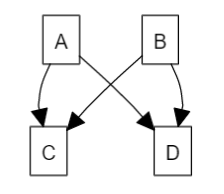
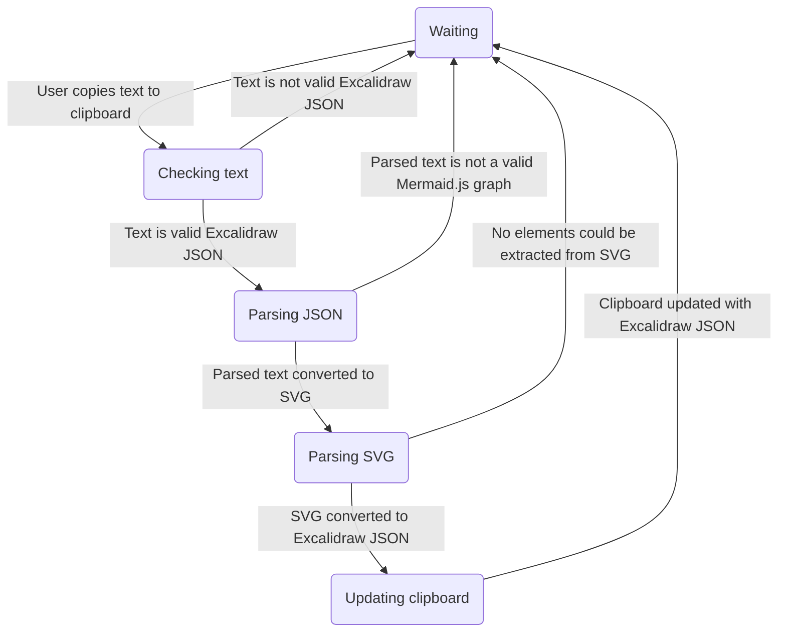
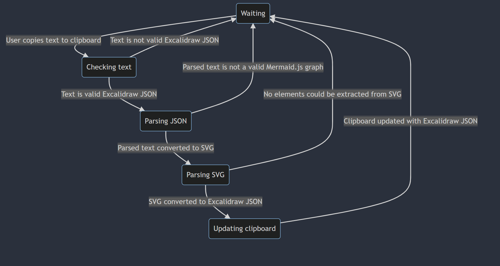
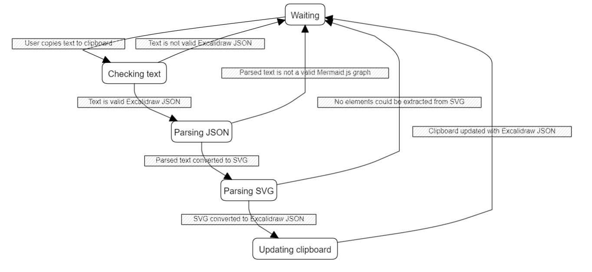

# Excalidraw / Mermaid.js Clipboard Monitor and Replacer

This library is a collection of scripts that monitor the clipboard and replace
any copied Excalidraw node containing a Mermaid.js diagram with the
diagram rendered with Mermaid.js and converted to a format that can be
pasted back into Excalidraw using Excalidraw's native drawing format.

This script was developed against Windows, but it uses pynput and pyperclip which
are supposed to be cross-platform so it should work on Mac as long as you jump through
MacOS's security hoops.

Speaking of, because this script takes data from your clipboard and submits
requests to a remote server when it thinks you've copied a diagram, it might
be detected as malicious.

## Prerequisites

 * [Python 3.10+](https://www.python.org/downloads/)

## Installation

```
git clone github.com/nottheswimmer/excalimaid
cd excalimaid
python3 -m venv venv
.\venv\Scripts\activate.bat  # Windows Only
source venv/bin/activate  # Linux/MacOS
pip install -r requirements.txt
```

## Running
```
.\venv\Scripts\activate.bat  # Windows Only
source venv/bin/activate  # Linux/MacOS
python3 graphpaste.py
```

## Usage

With the graphpaste.py script running...

1. Go to https://excalidraw.com/
2. Double click to start writing text
3. Paste in or type a mermaid.js diagram like this:
   ```
   graph TB
     A --> C
     A --> D
     B --> C
     B --> D
   ```
4. Press ESC and click on the node itself then press CTRL+C. Make sure you are not editing the text of the node.
5. Press CTRL+V after waiting a brief moment. A rendered diagram should be pasted in like so:
   
   

## Common issues
  1. Something isn't supported.
     See the specifications below to see what is supported.
  2. "No elements found in clipboard"
     What you copied doesn't look like an Excalidraw text node containing a mermaid.js diagram, 
       or no nodes could be extracted from the diagram once it was converted.
  3. It's not detecting the clipboard change.
     I had this happen once after moving from win32clipboard to pyperclip. If it's an issue I might
       change it to try and support either but prefer win32clipboard on Windows. It's just two functions
       in graphpaste.py so feel free to do it yourself.

## Specification

The `graphpaste.py` script is a keyboard listener that works as follows:

### Rendered diagram


### Raw diagram
```
graph
  S1("Waiting") -- User copies text to clipboard --> S2("Checking text")
  S2 -- Text is not valid Excalidraw JSON --> S1
  S2 -- Text is valid Excalidraw JSON --> S3("Parsing JSON")
  S3 -- Parsed text is not a valid Mermaid.js graph --> S1
  S3 -- Parsed text converted to SVG --> S4("Parsing SVG")
  S4 -- No elements could be extracted from SVG --> S1
  S4 -- SVG converted to Excalidraw JSON --> S5("Updating clipboard")
  S5 -- Clipboard updated with Excalidraw JSON --> S1
```

### Converted SVG by mermaid.live

```svg
<svg viewBox="0 0 115.4375 194" style="max-width: 115.4375px;" height="194" xmlns:xlink="http://www.w3.org/1999/xlink" xmlns="http://www.w3.org/2000/svg" width="100%" id="mermaid-svg"><style>#mermaid-svg {font-family:"trebuchet ms",verdana,arial,sans-serif;font-size:16px;fill:#333;}#mermaid-svg .error-icon{fill:#552222;}#mermaid-svg .error-text{fill:#552222;stroke:#552222;}#mermaid-svg .edge-thickness-normal{stroke-width:2px;}#mermaid-svg .edge-thickness-thick{stroke-width:3.5px;}#mermaid-svg .edge-pattern-solid{stroke-dasharray:0;}#mermaid-svg .edge-pattern-dashed{stroke-dasharray:3;}#mermaid-svg .edge-pattern-dotted{stroke-dasharray:2;}#mermaid-svg .marker{fill:#333333;stroke:#333333;}#mermaid-svg .marker.cross{stroke:#333333;}#mermaid-svg svg{font-family:"trebuchet ms",verdana,arial,sans-serif;font-size:16px;}#mermaid-svg .label{font-family:"trebuchet ms",verdana,arial,sans-serif;color:#333;}#mermaid-svg .cluster-label text{fill:#333;}#mermaid-svg .cluster-label span{color:#333;}#mermaid-svg .label text,#mermaid-svg span{fill:#333;color:#333;}#mermaid-svg .node rect,#mermaid-svg .node circle,#mermaid-svg .node ellipse,#mermaid-svg .node polygon,#mermaid-svg .node path{fill:#ECECFF;stroke:#9370DB;stroke-width:1px;}#mermaid-svg .node .label{text-align:center;}#mermaid-svg .node.clickable{cursor:pointer;}#mermaid-svg .arrowheadPath{fill:#333333;}#mermaid-svg .edgePath .path{stroke:#333333;stroke-width:2.0px;}#mermaid-svg .flowchart-link{stroke:#333333;fill:none;}#mermaid-svg .edgeLabel{background-color:#e8e8e8;text-align:center;}#mermaid-svg .edgeLabel rect{opacity:0.5;background-color:#e8e8e8;fill:#e8e8e8;}#mermaid-svg .cluster rect{fill:#ffffde;stroke:#aaaa33;stroke-width:1px;}#mermaid-svg .cluster text{fill:#333;}#mermaid-svg .cluster span{color:#333;}#mermaid-svg div.mermaidTooltip{position:absolute;text-align:center;max-width:200px;padding:2px;font-family:"trebuchet ms",verdana,arial,sans-serif;font-size:12px;background:hsl(80, 100%, 96.2745098039%);border:1px solid #aaaa33;border-radius:2px;pointer-events:none;z-index:100;}#mermaid-svg :root{--mermaid-font-family:"trebuchet ms",verdana,arial,sans-serif;}</style><g><g class="output"><g class="clusters"><g style="opacity: 1;" transform="translate(57.71875,97)" id="flowchart-user-4" class="cluster"><rect y="-89" x="-49.71875" height="178" width="99.4375"></rect><g id="mermaid-svgText" transform="translate(0, -75)" class="label"><g transform="translate(-15.0859375,-9.5)"><foreignObject height="19" width="30.171875"><div style="display: inline-block; white-space: nowrap;" xmlns="http://www.w3.org/1999/xhtml">user</div></foreignObject></g></g></g></g><g class="edgePaths"><g style="opacity: 1;" id="L-A-B" class="edgePath LS-A LE-B"><path style="fill:none" marker-end="url(#arrowhead23)" d="M57.71875,72L57.71875,76.16666666666667C57.71875,80.33333333333333,57.71875,88.66666666666667,57.71875,97C57.71875,105.33333333333333,57.71875,113.66666666666667,57.71875,117.83333333333333L57.71875,122" class="path"></path><defs><marker orient="auto" markerHeight="6" markerWidth="8" markerUnits="strokeWidth" refY="5" refX="9" viewBox="0 0 10 10" id="arrowhead23"><path style="stroke-width: 1; stroke-dasharray: 1, 0;" class="arrowheadPath" d="M 0 0 L 10 5 L 0 10 z"></path></marker></defs></g></g><g class="edgeLabels"><g style="opacity: 1;" transform="" class="edgeLabel"><g class="label" transform="translate(0,0)"><rect height="0" width="0" ry="0" rx="0"></rect><foreignObject height="0" width="0"><div style="display: inline-block; white-space: nowrap;" xmlns="http://www.w3.org/1999/xhtml"><span class="edgeLabel L-LS-A' L-LE-B" id="L-L-A-B"></span></div></foreignObject></g></g></g><g class="nodes"><g style="opacity: 1;" transform="translate(57.71875,141.5)" id="flowchart-B-3" class="node default"><rect class="label-container" height="39" width="29.0625" y="-19.5" x="-14.53125" ry="0" rx="0"></rect><g transform="translate(0,0)" class="label"><g transform="translate(-4.53125,-9.5)"><foreignObject height="19" width="9.0625"><div style="display: inline-block; white-space: nowrap;" xmlns="http://www.w3.org/1999/xhtml">B</div></foreignObject></g></g></g><g style="opacity: 1;" transform="translate(57.71875,52.5)" id="flowchart-A-2" class="node default"><rect class="label-container" height="39" width="29.4375" y="-19.5" x="-14.71875" ry="0" rx="0"></rect><g transform="translate(0,0)" class="label"><g transform="translate(-4.71875,-9.5)"><foreignObject height="19" width="9.4375"><div style="display: inline-block; white-space: nowrap;" xmlns="http://www.w3.org/1999/xhtml">A</div></foreignObject></g></g></g></g></g></g></svg>
```



### Converted JSON by excalidraw.py
```json
{"type": "excalidraw", "version": 2, "source": "https://nottheswimmer.org", "elements": [{"id": "L-S1-S2", "type": "arrow", "x": 511.34765625, "y": 32.04324481662263, "width": 373.61531, "height": 83.95675518337737, "angle": 0, "fillStyle": "hachure", "strokeWidth": 1, "strokeStyle": "solid", "roughness": 0, "opacity": 100.0, "groupIds": ["cc6142c1da6744e7"], "strokeSharpness": "sharp", "seed": 705420107, "version": 1, "versionNonce": 891163858, "isDeleted": false, "updated": 1651945995932, "backgroundColor": "transparent", "strokeColor": "#000000", "points": [[0.0, 0.0], [-66.576171875, 8.242792530562895], [-133.15234, 16.48559], [-158.98784, 19.75777], [-183.2334, 22.98011], [-205.88902, 26.15259], [-226.95469, 29.27521], [-246.43043, 32.34798], [-264.31622, 35.37089], [-280.61207, 38.34393], [-295.318, 41.26713], [-308.43397, 44.14047], [-319.96, 46.96396], [-373.61531, 60.95676], [-368.57617, 63.19926], [-363.79545, 65.32676], [-359.27315, 67.33926], [-355.00927, 69.23676], [-351.00379, 71.01926], [-347.25674, 72.68676], [-343.76812, 74.23926], [-340.5379, 75.67676], [-337.5661, 76.99926], [-334.85272, 78.20676], [-321.9318576388889, 83.95675518337737]], "endArrowhead": "triangle"}, {"id": "L-S2-S1", "type": "arrow", "x": 277.0529513888889, "y": 116.0, "width": 234.2947048611111, "height": 78.25758677085227, "angle": 0, "fillStyle": "hachure", "strokeWidth": 1, "strokeStyle": "solid", "roughness": 0, "opacity": 100.0, "groupIds": ["cc6142c1da6744e7"], "strokeSharpness": "sharp", "seed": 199498917, "version": 1, "versionNonce": 1163337538, "isDeleted": false, "updated": 1651945995933, "backgroundColor": "transparent", "strokeColor": "#000000", "points": [[0.0, 0.0], [12.920862268518533, -5.75], [25.84172, -11.5], [31.14215, -13.81543], [36.70671, -16.16172], [42.53542, -18.53886], [48.62829, -20.94687], [54.9853, -23.38574], [61.60646, -25.85546], [68.49176, -28.35603], [75.64121, -30.88747], [83.05481, -33.44978], [90.73257, -36.04293], [129.78168, -49.08586], [139.97171, -51.93011], [149.63916, -54.62849], [158.78405, -57.18101], [167.40637, -59.58769], [175.50613, -61.84849], [183.08333, -63.96344], [190.13795, -65.93254], [196.67002, -67.75577], [202.67951, -69.43314], [208.16645, -70.96466], [234.2947048611111, -78.25758677085227]], "endArrowhead": "triangle"}, {"id": "L-S2-S3", "type": "arrow", "x": 233.234375, "y": 155.0, "width": 79.2646484375, "height": 69.0, "angle": 0, "fillStyle": "hachure", "strokeWidth": 1, "strokeStyle": "solid", "roughness": 0, "opacity": 100.0, "groupIds": ["cc6142c1da6744e7"], "strokeSharpness": "sharp", "seed": 175141921, "version": 1, "versionNonce": 1428174231, "isDeleted": false, "updated": 1651945995933, "backgroundColor": "transparent", "strokeColor": "#000000", "points": [[0.0, 0.0], [0.0, 5.75], [0.0, 11.5], [0.13211, 13.8], [0.52843, 16.1], [1.18897, 18.4], [2.11372, 20.7], [3.30269, 23.0], [4.75588, 25.3], [6.47328, 27.6], [8.4549, 29.9], [10.70073, 32.2], [13.21077, 34.5], [26.42155, 46.0], [31.57375, 48.2425], [36.46174, 50.37], [41.08551, 52.3825], [45.44507, 54.28], [49.5404, 56.0625], [53.37153, 57.73], [56.93844, 59.2825], [60.24113, 60.72], [63.27961, 62.0425], [66.05387, 63.25], [79.2646484375, 69.0]], "endArrowhead": "triangle"}, {"id": "L-S3-S1", "type": "arrow", "x": 413.17578125, "y": 227.68152774933444, "width": 134.86719, "height": 180.68152774933444, "angle": 0, "fillStyle": "hachure", "strokeWidth": 1, "strokeStyle": "solid", "roughness": 0, "opacity": 100.0, "groupIds": ["cc6142c1da6744e7"], "strokeSharpness": "sharp", "seed": 2005561215, "version": 1, "versionNonce": 9099846, "isDeleted": false, "updated": 1651945995933, "backgroundColor": "transparent", "strokeColor": "#000000", "points": [[0.0, 0.0], [22.477864583333314, -6.363587958222411], [44.95573, -12.72718], [53.72209, -15.29897], [62.03891, -17.9235], [69.90616, -20.60076], [77.32385, -23.33075], [84.29199, -26.11346], [90.81058, -28.94889], [96.87959, -31.83706], [102.49906, -34.77796], [107.66898, -37.77159], [112.38932, -40.81794], [134.86719, -56.18153], [134.86719, -59.78153], [134.86719, -63.38153], [134.86719, -66.98153], [134.86719, -70.58153], [134.86719, -74.18153], [134.86719, -77.78153], [134.86719, -81.38153], [134.86719, -84.98153], [134.86719, -88.58153], [134.86719, -92.18153], [134.86719, -110.18153], [134.86719, -113.74903], [134.86719, -117.25153], [134.86719, -120.68903], [134.86719, -124.06153], [134.86719, -127.36903], [134.86719, -130.61153], [134.86719, -133.78903], [134.86719, -136.90153], [134.86719, -139.94903], [134.86719, -142.93153], [134.86719, -157.68153], [134.86719, -159.92403], [134.86719, -162.05153], [134.86719, -164.06403], [134.86719, -165.96153], [134.86719, -167.74403], [134.86719, -169.41153], [134.86719, -170.96403], [134.86719, -172.40153], [134.86719, -173.72403], [134.86719, -174.93153], [134.8671875, -180.68152774933444]], "endArrowhead": "triangle"}, {"id": "L-S3-S4", "type": "arrow", "x": 357.30078125, "y": 263.0, "width": 55.52593315972223, "height": 69.0, "angle": 0, "fillStyle": "hachure", "strokeWidth": 1, "strokeStyle": "solid", "roughness": 0, "opacity": 100.0, "groupIds": ["cc6142c1da6744e7"], "strokeSharpness": "sharp", "seed": 347610475, "version": 1, "versionNonce": 167490775, "isDeleted": false, "updated": 1651945995933, "backgroundColor": "transparent", "strokeColor": "#000000", "points": [[0.0, 0.0], [0.0, 5.75], [0.0, 11.5], [0.09254, 13.8], [0.37017, 16.1], [0.83289, 18.4], [1.48069, 20.7], [2.31358, 23.0], [3.33155, 25.3], [4.53462, 27.6], [5.92277, 29.9], [7.496, 32.2], [9.25432, 34.5], [18.50864, 46.0], [22.11783, 48.2425], [25.54193, 50.37], [28.78095, 52.3825], [31.83487, 54.28], [34.70371, 56.0625], [37.38746, 57.73], [39.88613, 59.2825], [42.19971, 60.72], [44.3282, 62.0425], [46.27161, 63.25], [55.52593315972223, 69.0]], "endArrowhead": "triangle"}, {"id": "L-S4-S1", "type": "arrow", "x": 495.8828125, "y": 341.45044949985225, "width": 225.98047, "height": 302.5504764673564, "angle": 0, "fillStyle": "hachure", "strokeWidth": 1, "strokeStyle": "solid", "roughness": 0, "opacity": 100.0, "groupIds": ["cc6142c1da6744e7"], "strokeSharpness": "sharp", "seed": 2136886778, "version": 1, "versionNonce": 938317989, "isDeleted": false, "updated": 1651945995933, "backgroundColor": "transparent", "strokeColor": "#000000", "points": [[0.0, 0.0], [37.66341145833337, -7.325074916642052], [75.32682, -14.65015], [90.01556, -17.59692], [103.95102, -20.57721], [117.13321, -23.59098], [129.56213, -26.63826], [141.23779, -29.71903], [152.16018, -32.8333], [162.3293, -35.98107], [171.74515, -39.16234], [180.40774, -42.37711], [188.31706, -45.62537], [225.98047, -61.95045], [225.98047, -65.55045], [225.98047, -69.15045], [225.98047, -72.75045], [225.98047, -76.35045], [225.98047, -79.95045], [225.98047, -83.55045], [225.98047, -87.15045], [225.98047, -90.75045], [225.98047, -94.35045], [225.98047, -97.95045], [225.98047, -115.95045], [225.98047, -119.55045], [225.98047, -123.15045], [225.98047, -126.75045], [225.98047, -130.35045], [225.98047, -133.95045], [225.98047, -137.55045], [225.98047, -141.15045], [225.98047, -144.75045], [225.98047, -148.35045], [225.98047, -151.95045], [225.98047, -169.95045], [225.98047, -173.55045], [225.98047, -177.15045], [225.98047, -180.75045], [225.98047, -184.35045], [225.98047, -187.95045], [225.98047, -191.55045], [225.98047, -195.15045], [225.98047, -198.75045], [225.98047, -202.35045], [225.98047, -205.95045], [225.98047, -223.95045], [225.75193, -227.53145], [225.0663, -231.07445], [223.9236, -234.57945], [222.3238, -238.04645], [220.26693, -241.47545], [217.75297, -244.86645], [214.78193, -248.21945], [211.35381, -251.53445], [207.46859, -254.81145], [203.1263, -258.05045], [180.27214, -274.15046], [171.35901, -276.91946], [162.90297, -279.54646], [154.90401, -282.03146], [147.36214, -284.37446], [140.27734, -286.57547], [133.64964, -288.63447], [127.47901, -290.55147], [121.76547, -292.32647], [116.50901, -293.95947], [111.70964, -295.45047], [88.85546875, -302.5504764673564]], "endArrowhead": "triangle"}, {"id": "L-S4-S5", "type": "arrow", "x": 444.2109375, "y": 371.0, "width": 54.547634548611086, "height": 69.0, "angle": 0, "fillStyle": "hachure", "strokeWidth": 1, "strokeStyle": "solid", "roughness": 0, "opacity": 100.0, "groupIds": ["cc6142c1da6744e7"], "strokeSharpness": "sharp", "seed": 983138938, "version": 1, "versionNonce": 1110537517, "isDeleted": false, "updated": 1651945995934, "backgroundColor": "transparent", "strokeColor": "#000000", "points": [[0.0, 0.0], [0.0, 5.75], [0.0, 11.5], [0.09091, 13.8], [0.36365, 16.1], [0.81821, 18.4], [1.4546, 20.7], [2.27282, 23.0], [3.27286, 25.3], [4.45472, 27.6], [5.81842, 29.9], [7.36394, 32.2], [9.09127, 34.5], [18.18254, 46.0], [21.72814, 48.2425], [25.09191, 50.37], [28.27386, 52.3825], [31.27398, 54.28], [34.09228, 56.0625], [36.72874, 57.73], [39.18339, 59.2825], [41.4562, 60.72], [43.54719, 62.0425], [45.45636, 63.25], [54.547634548611086, 69.0]], "endArrowhead": "triangle"}, {"id": "L-S5-S1", "type": "arrow", "x": 607.72265625, "y": 447.87793750538003, "width": 307.882815, "height": 414.627291334791, "angle": 0, "fillStyle": "hachure", "strokeWidth": 1, "strokeStyle": "solid", "roughness": 0, "opacity": 100.0, "groupIds": ["cc6142c1da6744e7"], "strokeSharpness": "sharp", "seed": 715017893, "version": 1, "versionNonce": 638826486, "isDeleted": false, "updated": 1651945995934, "backgroundColor": "transparent", "strokeColor": "#000000", "points": [[0.0, 0.0], [47.48307291666663, -7.062989584230024], [94.96615, -14.12598], [113.48454, -16.97055], [131.05329, -19.85386], [147.67236, -22.7759], [163.34177, -25.73668], [178.06153, -28.73621], [191.83162, -31.77448], [204.65204, -34.85148], [216.52281, -37.96723], [227.44392, -41.12172], [237.41536, -44.31495], [284.89844, -60.37794], [284.89844, -63.97794], [284.89844, -67.57794], [284.89844, -71.17794], [284.89844, -74.77794], [284.89844, -78.37794], [284.89844, -81.97794], [284.89844, -85.57794], [284.89844, -89.17794], [284.89844, -92.77794], [284.89844, -96.37794], [284.89844, -114.37794], [284.89844, -117.97794], [284.89844, -121.57794], [284.89844, -125.17794], [284.89844, -128.77794], [284.89844, -132.37794], [284.89844, -135.97794], [284.89844, -139.57794], [284.89844, -143.17794], [284.89844, -146.77794], [284.89844, -150.37794], [284.89844, -168.37794], [284.89844, -171.97794], [284.89844, -175.57794], [284.89844, -179.17794], [284.89844, -182.77794], [284.89844, -186.37794], [284.89844, -189.97794], [284.89844, -193.57794], [284.89844, -197.17794], [284.89844, -200.77794], [284.89844, -204.37794], [284.89844, -222.37794], [284.89844, -225.97794], [284.89844, -229.57794], [284.89844, -233.17794], [284.89844, -236.77794], [284.89844, -240.37794], [284.89844, -243.97794], [284.89844, -247.57794], [284.89844, -251.17794], [284.89844, -254.77794], [284.89844, -258.37794], [284.89844, -276.37794], [284.89844, -279.97794], [284.89844, -283.57794], [284.89844, -287.17794], [284.89844, -290.77794], [284.89844, -294.37794], [284.89844, -297.97794], [284.89844, -301.57794], [284.89844, -305.17794], [284.89844, -308.77794], [284.89844, -312.37794], [284.89844, -330.37794], [284.3853, -333.96836], [282.84589, -337.5396], [280.2802, -341.09168], [276.68823, -344.62459], [272.06999, -348.13833], [266.42547, -351.6329], [259.75468, -355.1083], [252.05761, -358.56453], [243.33426, -362.0016], [233.58464, -365.4195], [182.27083, -382.46106], [162.25845, -385.59727], [143.27234, -388.57264], [125.31251, -391.38718], [108.37896, -394.0409], [92.47168, -396.53378], [77.59068, -398.86584], [63.73595, -401.03705], [50.9075, -403.04745], [39.10533, -404.89701], [28.32943, -406.58573], [-22.984375, -414.627291334791]], "endArrowhead": "triangle"}, {"id": "372a56df95934dac", "type": "text", "x": 8.0, "y": 72.0, "width": 207.78125, "height": 19.0, "angle": 0, "fillStyle": "hachure", "strokeWidth": 1, "strokeStyle": "solid", "roughness": 0, "opacity": 100, "groupIds": ["6ed2002a43b14cb7", "cc6142c1da6744e7"], "strokeSharpness": "sharp", "seed": 1169092583, "version": 1, "versionNonce": 1829517472, "isDeleted": false, "updated": 1651945995935, "backgroundColor": "transparent", "strokeColor": "#000000", "text": "User copies text to clipboard", "fontSize": 12.8, "fontFamily": 2, "textAlign": "center", "verticalAlign": "middle", "baseline": 17.5, "containerId": "ac43defdc8334c20", "originalText": "User copies text to clipboard"}, {"id": "ac43defdc8334c20", "type": "rectangle", "x": 8.0, "y": 72.0, "width": 207.78125, "height": 19.0, "angle": 0, "fillStyle": "hachure", "strokeWidth": 1, "strokeStyle": "solid", "roughness": 0, "opacity": 100, "groupIds": ["6ed2002a43b14cb7", "cc6142c1da6744e7"], "strokeSharpness": "sharp", "seed": 1627228879, "version": 1, "versionNonce": 1260368881, "isDeleted": false, "updated": 1651945995935, "backgroundColor": "#e0e0e0", "strokeColor": "#000000", "boundElements": [{"id": "372a56df95934dac", "type": "text"}]}, {"id": "ad41c794ee4444a8", "type": "text", "x": 235.78125, "y": 72.0, "width": 237.59375, "height": 19.0, "angle": 0, "fillStyle": "hachure", "strokeWidth": 1, "strokeStyle": "solid", "roughness": 0, "opacity": 100, "groupIds": ["066833682e4643de", "cc6142c1da6744e7"], "strokeSharpness": "sharp", "seed": 1368671764, "version": 1, "versionNonce": 904049811, "isDeleted": false, "updated": 1651945995935, "backgroundColor": "transparent", "strokeColor": "#000000", "text": "Text is not valid Excalidraw JSON", "fontSize": 12.8, "fontFamily": 2, "textAlign": "center", "verticalAlign": "middle", "baseline": 17.5, "containerId": "31535409b8eb42cc", "originalText": "Text is not valid Excalidraw JSON"}, {"id": "31535409b8eb42cc", "type": "rectangle", "x": 235.78125, "y": 72.0, "width": 237.59375, "height": 19.0, "angle": 0, "fillStyle": "hachure", "strokeWidth": 1, "strokeStyle": "solid", "roughness": 0, "opacity": 100, "groupIds": ["066833682e4643de", "cc6142c1da6744e7"], "strokeSharpness": "sharp", "seed": 1123512670, "version": 1, "versionNonce": 1041875254, "isDeleted": false, "updated": 1651945995935, "backgroundColor": "#e0e0e0", "strokeColor": "#000000", "boundElements": [{"id": "ad41c794ee4444a8", "type": "text"}]}, {"id": "a14ba6477b514eec", "type": "text", "x": 128.6875, "y": 180.0, "width": 209.09375, "height": 19.0, "angle": 0, "fillStyle": "hachure", "strokeWidth": 1, "strokeStyle": "solid", "roughness": 0, "opacity": 100, "groupIds": ["15890721ae5f424f", "cc6142c1da6744e7"], "strokeSharpness": "sharp", "seed": 1371458139, "version": 1, "versionNonce": 560517842, "isDeleted": false, "updated": 1651945995945, "backgroundColor": "transparent", "strokeColor": "#000000", "text": "Text is valid Excalidraw JSON", "fontSize": 12.8, "fontFamily": 2, "textAlign": "center", "verticalAlign": "middle", "baseline": 17.5, "containerId": "25e5c1f86aeb4c5a", "originalText": "Text is valid Excalidraw JSON"}, {"id": "25e5c1f86aeb4c5a", "type": "rectangle", "x": 128.6875, "y": 180.0, "width": 209.09375, "height": 19.0, "angle": 0, "fillStyle": "hachure", "strokeWidth": 1, "strokeStyle": "solid", "roughness": 0, "opacity": 100, "groupIds": ["15890721ae5f424f", "cc6142c1da6744e7"], "strokeSharpness": "sharp", "seed": 1051220463, "version": 1, "versionNonce": 696594062, "isDeleted": false, "updated": 1651945995945, "backgroundColor": "#e0e0e0", "strokeColor": "#000000", "boundElements": [{"id": "a14ba6477b514eec", "type": "text"}]}, {"id": "c59d7bcd014946c3", "type": "text", "x": 394.22265625, "y": 126.0, "width": 307.640625, "height": 19.0, "angle": 0, "fillStyle": "hachure", "strokeWidth": 1, "strokeStyle": "solid", "roughness": 0, "opacity": 100, "groupIds": ["fa15f86b26e64fd7", "cc6142c1da6744e7"], "strokeSharpness": "sharp", "seed": 49559270, "version": 1, "versionNonce": 39897427, "isDeleted": false, "updated": 1651945995945, "backgroundColor": "transparent", "strokeColor": "#000000", "text": "Parsed text is not a valid Mermaid.js graph", "fontSize": 12.8, "fontFamily": 2, "textAlign": "center", "verticalAlign": "middle", "baseline": 17.5, "containerId": "f902ab037c084d43", "originalText": "Parsed text is not a valid Mermaid.js graph"}, {"id": "f902ab037c084d43", "type": "rectangle", "x": 394.22265625, "y": 126.0, "width": 307.640625, "height": 19.0, "angle": 0, "fillStyle": "hachure", "strokeWidth": 1, "strokeStyle": "solid", "roughness": 0, "opacity": 100, "groupIds": ["fa15f86b26e64fd7", "cc6142c1da6744e7"], "strokeSharpness": "sharp", "seed": 579237521, "version": 1, "versionNonce": 816859485, "isDeleted": false, "updated": 1651945995945, "backgroundColor": "#e0e0e0", "strokeColor": "#000000", "boundElements": [{"id": "c59d7bcd014946c3", "type": "text"}]}, {"id": "277a7bb0d2cb4766", "type": "text", "x": 252.05859375, "y": 288.0, "width": 210.484375, "height": 19.0, "angle": 0, "fillStyle": "hachure", "strokeWidth": 1, "strokeStyle": "solid", "roughness": 0, "opacity": 100, "groupIds": ["0dfcb42ceb034614", "cc6142c1da6744e7"], "strokeSharpness": "sharp", "seed": 1652679551, "version": 1, "versionNonce": 804955017, "isDeleted": false, "updated": 1651945995962, "backgroundColor": "transparent", "strokeColor": "#000000", "text": "Parsed text converted to SVG", "fontSize": 12.8, "fontFamily": 2, "textAlign": "center", "verticalAlign": "middle", "baseline": 17.5, "containerId": "afb9bf21aa094bca", "originalText": "Parsed text converted to SVG"}, {"id": "afb9bf21aa094bca", "type": "rectangle", "x": 252.05859375, "y": 288.0, "width": 210.484375, "height": 19.0, "angle": 0, "fillStyle": "hachure", "strokeWidth": 1, "strokeStyle": "solid", "roughness": 0, "opacity": 100, "groupIds": ["0dfcb42ceb034614", "cc6142c1da6744e7"], "strokeSharpness": "sharp", "seed": 907679119, "version": 1, "versionNonce": 1018259879, "isDeleted": false, "updated": 1651945995962, "backgroundColor": "#e0e0e0", "strokeColor": "#000000", "boundElements": [{"id": "277a7bb0d2cb4766", "type": "text"}]}, {"id": "0f08b3c1edcc465a", "type": "text", "x": 571.10546875, "y": 180.0, "width": 301.515625, "height": 19.0, "angle": 0, "fillStyle": "hachure", "strokeWidth": 1, "strokeStyle": "solid", "roughness": 0, "opacity": 100, "groupIds": ["bdb53105c1f5458d", "cc6142c1da6744e7"], "strokeSharpness": "sharp", "seed": 1363438970, "version": 1, "versionNonce": 1888731092, "isDeleted": false, "updated": 1651945995962, "backgroundColor": "transparent", "strokeColor": "#000000", "text": "No elements could be extracted from SVG", "fontSize": 12.8, "fontFamily": 2, "textAlign": "center", "verticalAlign": "middle", "baseline": 17.5, "containerId": "8c02861eb7574702", "originalText": "No elements could be extracted from SVG"}, {"id": "8c02861eb7574702", "type": "rectangle", "x": 571.10546875, "y": 180.0, "width": 301.515625, "height": 19.0, "angle": 0, "fillStyle": "hachure", "strokeWidth": 1, "strokeStyle": "solid", "roughness": 0, "opacity": 100, "groupIds": ["bdb53105c1f5458d", "cc6142c1da6744e7"], "strokeSharpness": "sharp", "seed": 1917640751, "version": 1, "versionNonce": 126821909, "isDeleted": false, "updated": 1651945995962, "backgroundColor": "#e0e0e0", "strokeColor": "#000000", "boundElements": [{"id": "0f08b3c1edcc465a", "type": "text"}]}, {"id": "5e6992d3011d406a", "type": "text", "x": 320.1640625, "y": 396.0, "width": 248.09375, "height": 19.0, "angle": 0, "fillStyle": "hachure", "strokeWidth": 1, "strokeStyle": "solid", "roughness": 0, "opacity": 100, "groupIds": ["0b97e1c38f024c11", "cc6142c1da6744e7"], "strokeSharpness": "sharp", "seed": 1686281574, "version": 1, "versionNonce": 983378773, "isDeleted": false, "updated": 1651945995977, "backgroundColor": "transparent", "strokeColor": "#000000", "text": "SVG converted to Excalidraw JSON", "fontSize": 12.8, "fontFamily": 2, "textAlign": "center", "verticalAlign": "middle", "baseline": 17.5, "containerId": "428709626c7a462b", "originalText": "SVG converted to Excalidraw JSON"}, {"id": "428709626c7a462b", "type": "rectangle", "x": 320.1640625, "y": 396.0, "width": 248.09375, "height": 19.0, "angle": 0, "fillStyle": "hachure", "strokeWidth": 1, "strokeStyle": "solid", "roughness": 0, "opacity": 100, "groupIds": ["0b97e1c38f024c11", "cc6142c1da6744e7"], "strokeSharpness": "sharp", "seed": 101476346, "version": 1, "versionNonce": 769939649, "isDeleted": false, "updated": 1651945995977, "backgroundColor": "#e0e0e0", "strokeColor": "#000000", "boundElements": [{"id": "5e6992d3011d406a", "type": "text"}]}, {"id": "752625b082c74258", "type": "text", "x": 746.33984375, "y": 234.0, "width": 292.5625, "height": 19.0, "angle": 0, "fillStyle": "hachure", "strokeWidth": 1, "strokeStyle": "solid", "roughness": 0, "opacity": 100, "groupIds": ["0d3d3730c7e44522", "cc6142c1da6744e7"], "strokeSharpness": "sharp", "seed": 272711340, "version": 1, "versionNonce": 1174928837, "isDeleted": false, "updated": 1651945995977, "backgroundColor": "transparent", "strokeColor": "#000000", "text": "Clipboard updated with Excalidraw JSON", "fontSize": 12.8, "fontFamily": 2, "textAlign": "center", "verticalAlign": "middle", "baseline": 17.5, "containerId": "05ef2a1e5256471b", "originalText": "Clipboard updated with Excalidraw JSON"}, {"id": "05ef2a1e5256471b", "type": "rectangle", "x": 746.33984375, "y": 234.0, "width": 292.5625, "height": 19.0, "angle": 0, "fillStyle": "hachure", "strokeWidth": 1, "strokeStyle": "solid", "roughness": 0, "opacity": 100, "groupIds": ["0d3d3730c7e44522", "cc6142c1da6744e7"], "strokeSharpness": "sharp", "seed": 1853959790, "version": 1, "versionNonce": 1831557102, "isDeleted": false, "updated": 1651945995977, "backgroundColor": "#e0e0e0", "strokeColor": "#000000", "boundElements": [{"id": "752625b082c74258", "type": "text"}]}, {"id": "98955e0009b14f96", "type": "text", "x": 521.34765625, "y": 18.0, "width": 53.390625, "height": 19.0, "angle": 0, "fillStyle": "hachure", "strokeWidth": 1, "strokeStyle": "solid", "roughness": 0, "opacity": 100, "groupIds": ["98abd52632f0494f", "cc6142c1da6744e7"], "strokeSharpness": "sharp", "seed": 408211550, "version": 1, "versionNonce": 1630776195, "isDeleted": false, "updated": 1651945995993, "backgroundColor": "transparent", "strokeColor": "#000000", "text": "Waiting", "fontSize": 16, "fontFamily": 2, "textAlign": "center", "verticalAlign": "middle", "baseline": 17.5, "containerId": "86523f5b9acf4941", "originalText": "Waiting"}, {"id": "86523f5b9acf4941", "type": "rectangle", "x": 511.34765625, "y": 8.0, "width": 73.390625, "height": 39.0, "angle": 0, "fillStyle": "hachure", "strokeWidth": 1, "strokeStyle": "solid", "roughness": 0, "opacity": 100, "groupIds": ["98abd52632f0494f", "cc6142c1da6744e7"], "strokeSharpness": "round", "seed": 195514562, "version": 1, "versionNonce": 839079859, "isDeleted": false, "updated": 1651945995993, "backgroundColor": "transparent", "strokeColor": "#000000", "boundElements": [{"id": "98955e0009b14f96", "type": "text"}]}, {"id": "dd242badce284c0d", "type": "text", "x": 183.921875, "y": 126.0, "width": 98.625, "height": 19.0, "angle": 0, "fillStyle": "hachure", "strokeWidth": 1, "strokeStyle": "solid", "roughness": 0, "opacity": 100, "groupIds": ["16320f51b659489f", "cc6142c1da6744e7"], "strokeSharpness": "sharp", "seed": 1053307756, "version": 1, "versionNonce": 2113701255, "isDeleted": false, "updated": 1651945995993, "backgroundColor": "transparent", "strokeColor": "#000000", "text": "Checking text", "fontSize": 16, "fontFamily": 2, "textAlign": "center", "verticalAlign": "middle", "baseline": 17.5, "containerId": "53cb5b68706642f4", "originalText": "Checking text"}, {"id": "53cb5b68706642f4", "type": "rectangle", "x": 173.921875, "y": 116.0, "width": 118.625, "height": 39.0, "angle": 0, "fillStyle": "hachure", "strokeWidth": 1, "strokeStyle": "solid", "roughness": 0, "opacity": 100, "groupIds": ["16320f51b659489f", "cc6142c1da6744e7"], "strokeSharpness": "round", "seed": 378190155, "version": 1, "versionNonce": 740255061, "isDeleted": false, "updated": 1651945995993, "backgroundColor": "transparent", "strokeColor": "#000000", "boundElements": [{"id": "dd242badce284c0d", "type": "text"}]}, {"id": "0ef20a129f814923", "type": "text", "x": 311.42578125, "y": 234.0, "width": 91.75, "height": 19.0, "angle": 0, "fillStyle": "hachure", "strokeWidth": 1, "strokeStyle": "solid", "roughness": 0, "opacity": 100, "groupIds": ["0a47d18dce4e4b49", "cc6142c1da6744e7"], "strokeSharpness": "sharp", "seed": 134414876, "version": 1, "versionNonce": 848590581, "isDeleted": false, "updated": 1651945996009, "backgroundColor": "transparent", "strokeColor": "#000000", "text": "Parsing JSON", "fontSize": 16, "fontFamily": 2, "textAlign": "center", "verticalAlign": "middle", "baseline": 17.5, "containerId": "8ad5ffe50f59499f", "originalText": "Parsing JSON"}, {"id": "8ad5ffe50f59499f", "type": "rectangle", "x": 301.42578125, "y": 224.0, "width": 111.75, "height": 39.0, "angle": 0, "fillStyle": "hachure", "strokeWidth": 1, "strokeStyle": "solid", "roughness": 0, "opacity": 100, "groupIds": ["0a47d18dce4e4b49", "cc6142c1da6744e7"], "strokeSharpness": "round", "seed": 1653055128, "version": 1, "versionNonce": 880759769, "isDeleted": false, "updated": 1651945996009, "backgroundColor": "transparent", "strokeColor": "#000000", "boundElements": [{"id": "0ef20a129f814923", "type": "text"}]}, {"id": "2b0e67607ee440b8", "type": "text", "x": 402.5390625, "y": 342.0, "width": 83.34375, "height": 19.0, "angle": 0, "fillStyle": "hachure", "strokeWidth": 1, "strokeStyle": "solid", "roughness": 0, "opacity": 100, "groupIds": ["b2d0469c21094d06", "cc6142c1da6744e7"], "strokeSharpness": "sharp", "seed": 324707555, "version": 1, "versionNonce": 157902037, "isDeleted": false, "updated": 1651945996009, "backgroundColor": "transparent", "strokeColor": "#000000", "text": "Parsing SVG", "fontSize": 16, "fontFamily": 2, "textAlign": "center", "verticalAlign": "middle", "baseline": 17.5, "containerId": "93855f1cfca74228", "originalText": "Parsing SVG"}, {"id": "93855f1cfca74228", "type": "rectangle", "x": 392.5390625, "y": 332.0, "width": 103.34375, "height": 39.0, "angle": 0, "fillStyle": "hachure", "strokeWidth": 1, "strokeStyle": "solid", "roughness": 0, "opacity": 100, "groupIds": ["b2d0469c21094d06", "cc6142c1da6744e7"], "strokeSharpness": "round", "seed": 1034288750, "version": 1, "versionNonce": 507050317, "isDeleted": false, "updated": 1651945996009, "backgroundColor": "transparent", "strokeColor": "#000000", "boundElements": [{"id": "2b0e67607ee440b8", "type": "text"}]}, {"id": "258b2199949a4cc7", "type": "text", "x": 461.45703125, "y": 450.0, "width": 136.265625, "height": 19.0, "angle": 0, "fillStyle": "hachure", "strokeWidth": 1, "strokeStyle": "solid", "roughness": 0, "opacity": 100, "groupIds": ["b2aee23c1bac4f52", "cc6142c1da6744e7"], "strokeSharpness": "sharp", "seed": 1507146926, "version": 1, "versionNonce": 1507696541, "isDeleted": false, "updated": 1651945996025, "backgroundColor": "transparent", "strokeColor": "#000000", "text": "Updating clipboard", "fontSize": 16, "fontFamily": 2, "textAlign": "center", "verticalAlign": "middle", "baseline": 17.5, "containerId": "76426c12a59e4e2f", "originalText": "Updating clipboard"}, {"id": "76426c12a59e4e2f", "type": "rectangle", "x": 451.45703125, "y": 440.0, "width": 156.265625, "height": 39.0, "angle": 0, "fillStyle": "hachure", "strokeWidth": 1, "strokeStyle": "solid", "roughness": 0, "opacity": 100, "groupIds": ["b2aee23c1bac4f52", "cc6142c1da6744e7"], "strokeSharpness": "round", "seed": 310749784, "version": 1, "versionNonce": 458381155, "isDeleted": false, "updated": 1651945996025, "backgroundColor": "transparent", "strokeColor": "#000000", "boundElements": [{"id": "258b2199949a4cc7", "type": "text"}]}], "appState": {"viewBackgroundColor": "#ffffff", "gridSize": null}, "files": {}}
```

### Rendered output as pasted back into Excalidraw



### Disclaimers

 * Not all diagram types are supported. This mainly supports
   * graph
   * flowchart
   * classDiagram
   * stateDiagram-v2
 * For these diagrams, not every feature is supported. This supports
   * text
   * arrows
   * rectangles
   * diamonds
   * rounded shapes
   * links (e.g. `click B "http://www.github.com" "(Ignored tooltip)"`)
 * Some things have buggy implementations like
   * subgraphs
   * circles
 * Some things for these graph types aren't supported such as
   * [styling a node](https://mermaid-js.github.io/mermaid/#/flowchart?id=styling-a-node)
   * [styling links](https://mermaid-js.github.io/mermaid/#/flowchart?id=styling-links)
   * [shapes not mentioned](https://mermaid-js.github.io/mermaid/#/flowchart?id=node-shapes)
 * The graphpaste.py script modifies the input a little bit to remove common bugs.
   * ` - ` is replaced with ` -- `
   * ` -> ` is replaced with ` --> `
   * `graph:` is replaced with `graph`
